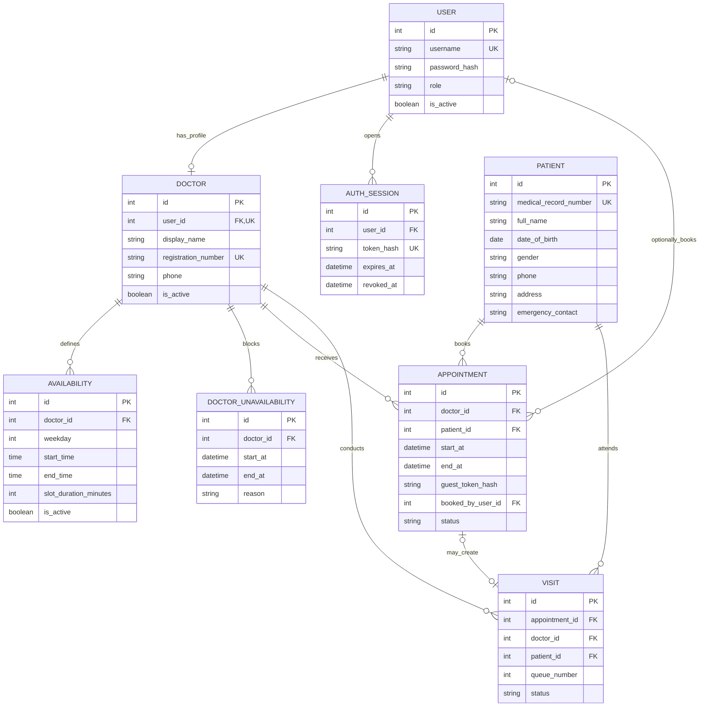

# Medical Clinic Booking and Queue API

A FastAPI backend for public appointment booking and staff-managed clinic queues. Patients can book without creating an account. Optional patient accounts provide access to bookings made while signed in. The repository provides APIs and interactive `/docs`, plus a React web app in [`frontend/`](frontend/README.md) for public booking and the staff portal.

## Scope and privacy

- Public doctor profiles, available appointment slots and remaining capacity.
- Guest booking with name and phone number only, alongside doctor and selected time.
- Private booking management using a random token; only its SHA-256 hash is stored.
- Optional patient registration and login; patient accounts never grant staff access.
- Staff login for patient registration, schedules, check-in, walk-ins and queue management.
- Doctors can access only their own appointments and queues; administrators can manage either doctor.
- No prescription, diagnosis, symptom, consultation-note or treatment-plan fields in the booking/queue API or new database schema. Unknown clinical fields are rejected.

Guest bookings create a minimal patient record with no required birth date, gender, address or emergency contact. Staff can still maintain optional demographic/contact information. Names and phone numbers are not treated as proof of identity, and guest submissions never attach themselves to an existing patient record by matching these values.

**Phone verification is not implemented:** no SMS/email provider is configured. A booking management token proves possession of that token, not ownership of a phone number or a medical identity. Keep it private. Before public deployment, integrate contact verification and abuse protection/rate limiting at the API gateway or application layer. Use HTTPS and avoid logging authorization headers, booking tokens or request bodies.

## Technology

- Python and FastAPI
- SQLAlchemy for database access
- PostgreSQL with the Psycopg driver

A cloud deployment can be introduced later if the clinic needs to support remote access.

## Run the application locally

### 1. Install Python and PostgreSQL

Install Python 3.14 and confirm that it is available:

```bash
python3 --version
```

Install PostgreSQL and pgAdmin, then start the local PostgreSQL server.

### 2. Create the PostgreSQL databases

The application can create tables only after its PostgreSQL database exists. In pgAdmin, connect to the default `postgres` database and open **Query Tool**. Run each statement separately, replacing the example password with your own password:

```sql
CREATE ROLE clinic_app WITH LOGIN PASSWORD 'change-this-password';
```

```sql
CREATE DATABASE medical_clinic OWNER clinic_app;
```

### 3. Create a virtual environment

Open Terminal in the project folder, then create and activate a virtual environment:

```bash
python3 -m venv .venv
source .venv/bin/activate
```

When the environment is active, `(.venv)` appears at the beginning of the Terminal prompt.

### 4. Install the dependencies

```bash
python -m pip install -r requirements.txt
```

### 5. Create the environment file

Copy the example configuration:

```bash
cp .env.example .env
```

Open `.env`, replace `change-this-password` in the PostgreSQL URL with the password used when creating `clinic_app`, and choose strong initial passwords for the administrator and both doctors. The `.env` file is ignored by Git because it contains database credentials and other secrets.

### 6. Create the tables and start the application

```bash
python main.py
```

At startup, SQLAlchemy connects to `medical_clinic` and creates any missing tables, constraints and relationships from the application models. It also adds the initial administrator and two doctor accounts. The application intentionally accepts only a `postgresql+psycopg://` database URL.

Open these addresses in a web browser:

- Application: http://127.0.0.1:8000
- Interactive API documentation: http://127.0.0.1:8000/docs
- Health check: http://127.0.0.1:8000/api/health

Press `Control+C` in Terminal to stop the application.

### 7. Start the web app (optional)

With the backend running, open a second Terminal in the `frontend` folder and run `npm install` and then `npm run dev`. Then open http://localhost:5173. See [frontend/README.md](frontend/README.md) for details.

### Run with PyCharm

Select `.venv/bin/python` as the project interpreter. Create a Python Run Configuration with `main.py` as the script and the project folder as the working directory, then click **Run**. Starting `main.py` also initializes the database automatically.

### Run the tests

Confirm that PostgreSQL is running, then run:

```bash
pytest
```

Tests use `CLINIC_DATABASE_URL` and create a uniquely named temporary PostgreSQL schema. Only that temporary schema is removed after each test; the application's normal tables and clinic data are not changed.

## Authentication and doctor accounts

The local environment uses these initial usernames:

- Administrator: `admin`
- Doctor One: `doctor1`
- Doctor Two: `doctor2`

Before creating a new database, set `CLINIC_ADMIN_PASSWORD`, `CLINIC_DOCTOR_ONE_PASSWORD` and `CLINIC_DOCTOR_TWO_PASSWORD` in `.env`. There are no initial password defaults in the Python code. These values create missing accounts only and never overwrite passwords for existing accounts.

Log in with `POST /api/auth/login`, then copy the returned access token. In the interactive API documentation, click **Authorize** and enter the token to call protected endpoints. `POST /api/auth/logout` immediately revokes the current token.

Logged-in users can change their password with `PUT /api/auth/password`. They must provide their current password and a new password of at least 12 characters. Administrators can reset another account with `PUT /api/admin/users/{user_id}/password`. A password change or reset revokes all active sessions for that account and requires a new login.

### Permissions

- Administrators can view both doctor profiles, update either profile and activate or deactivate a doctor.
- Administrators can manage working hours and unavailable dates for either doctor.
- Doctors can view doctor profiles and schedules, update their own profile and manage their own schedule.
- Doctors cannot update another doctor's profile or change registration and active-status fields.

### Authentication and doctor APIs

- `POST /api/auth/login` — log in and create a session.
- `POST /api/auth/logout` — log out and revoke the current session.
- `GET /api/auth/me` — return the logged-in account and doctor profile.
- `PUT /api/auth/password` — change the logged-in user's password.
- `PUT /api/admin/users/{user_id}/password` — let an administrator reset a user's password.
- `GET /api/admin/doctors` — list all profiles, including inactive doctors and staff fields (administrator only).
- `GET /api/doctors` — publicly list active doctors (name and registration number only).
- `GET /api/doctors/me` — return the logged-in doctor's profile.
- `PATCH /api/doctors/me` — let a doctor update their own profile.
- `GET /api/doctors/{doctor_id}` — publicly return one active doctor profile.
- `PATCH /api/doctors/{doctor_id}` — let an administrator update a doctor profile.

## Staff doctor scheduling

Availability records define a doctor's weekday, working period and appointment-slot duration. The default is 10 minutes per patient (12 slots in two hours, or 18 in three hours). A different duration can still be specified explicitly when managing a schedule. Weekdays use `0` for Monday through `4` for Friday. Unavailability records use `start_at` and `end_at`, so they can block part of a day, a full day or several days.

- `GET /api/doctors/{doctor_id}/availability` — list weekly availability.
- `POST /api/doctors/{doctor_id}/availability` — add an availability period.
- `PUT /api/doctors/{doctor_id}/availability/{availability_id}` — replace an availability period.
- `DELETE /api/doctors/{doctor_id}/availability/{availability_id}` — remove an availability period.
- `GET /api/doctors/{doctor_id}/unavailability` — list unavailable periods.
- `POST /api/doctors/{doctor_id}/unavailability` — add an unavailable period.
- `PUT /api/doctors/{doctor_id}/unavailability/{unavailability_id}` — replace an unavailable period.
- `DELETE /api/doctors/{doctor_id}/unavailability/{unavailability_id}` — remove an unavailable period.

## Staff patient management

After logging in, administrators and doctors can:

- Register a patient and receive an automatically generated medical record number.
- Search patients by medical record number, name or phone number.
- View and edit patient details.

Patient management is currently available through these protected REST endpoints:

- `POST /api/patients` — register a patient.
- `GET /api/patients` — list patients or search with the `query` parameter.
- `GET /api/patients/{patient_id}` — return one patient's details.
- `PATCH /api/patients/{patient_id}` — update a patient's details.

## Staff dashboard API

Call `GET /api/dashboard` with an administrator or doctor bearer token. No dashboard HTML page is served.

- Today's appointment list includes patient names, doctors, times and status, sorted by reserved time.
- Summary fields report total appointments, waiting patients, in-progress consultations and completed visits.
- Doctor queues contain only waiting/in-progress visits; completed and cancelled visits leave the active queue.
- Administrators can see all doctors or filter by one doctor. A doctor can see only their own appointments and queue. Patient accounts cannot access dashboard data.
- Quick actions use `POST /api/patients`, `POST /api/appointments`, and `POST /api/visits/walk-in` for registration, booking and walk-ins.
- Each appointment or queue entry includes allowed actions with a label, HTTP method, API path and request body for check-in, start, complete or cancel. The mutation endpoints enforce permissions and check conflicts again.

`GET /api/dashboard` returns a staff-authenticated daily snapshot. Optional `doctor_id` filters the snapshot, subject to the same ownership checks. Responses use `Cache-Control: no-store` and contain no patient phone numbers, clinical fields or booking tokens.

“Today” uses `CLINIC_TIMEZONE` (default `Asia/Colombo`), with an inclusive local midnight and exclusive next midnight. Appointment totals include cancelled/no-show bookings; scheduled, cancelled and no-show subtotals are provided separately. Waiting, in-progress and completed counts refer to visits on that clinic date, including legacy walk-ins without appointments. Empty doctor queues remain visible, including inactive doctors for administrators, so existing work is not hidden.

The dashboard uses existing API endpoints and does not require a schema change beyond the earlier booking upgrade.

## Guest booking

No login is required for these endpoints:

| Endpoint | Purpose |
| --- | --- |
| `GET /api/doctors` | Browse active doctors |
| `GET /api/doctors/{doctor_id}` | View public doctor details |
| `GET /api/doctors/{doctor_id}/available-slots?day=2030-01-07` | Browse slots |
| `GET /api/doctors/{doctor_id}/booking-status?day=2030-01-07` | Check remaining capacity |
| `POST /api/guest/appointments` | Book using name, phone, doctor and time |

Example guest request (choose an actual available future slot):

```json
{
  "doctor_id": 1,
  "start_at": "2030-01-07T09:00:00+05:30",
  "full_name": "Nimal Perera",
  "phone": "+94771234567"
}
```

The response contains `id`, `doctor_id`, `start_at`, `end_at`, `status`, and a one-time-displayed `management_token`. Save the token securely. The API sends `Cache-Control: no-store`. It does not expose the patient ID, contact details or token hash.

Send the token in the `X-Booking-Token` header for:

- `GET /api/guest/appointments/{appointment_id}`
- `PUT /api/guest/appointments/{appointment_id}/cancel`
- `PUT /api/guest/appointments/{appointment_id}/reschedule` with `{"start_at": "...timezone-aware datetime..."}`

Tokens are scoped to a single booking and expire 24 hours after its current end time. They cannot retrieve patient records or other bookings. Lost tokens require staff assistance; the API does not recover them using an unverified phone number.

## Optional patient accounts

`POST /api/auth/register-patient` accepts only `username` and `password` (at least 12 characters). The server assigns the patient role. Login uses the existing `/api/auth/login` endpoint.

To associate a new booking with the account, include its bearer token when calling `/api/guest/appointments`. Booking without a token remains supported. Existing guest bookings are not automatically claimed through a matching name or phone number.

- `GET /api/my/appointments` returns up to 100 recent bookings made with that account.
- `PUT /api/my/appointments/{appointment_id}/cancel` cancels an owned booking.
- `PUT /api/my/appointments/{appointment_id}/reschedule` moves an owned booking.

Patients can change their password and log out. They cannot use staff patient, scheduling, appointment or queue APIs.

## Staff appointments and queues

`POST /api/appointments` accepts `doctor_id`, `patient_id`, and timezone-aware `start_at`. It requires an administrator or the assigned doctor. The same permissions apply to reading, cancelling and rescheduling through `/api/appointments/{appointment_id}`.

- `POST /api/appointments/{appointment_id}/check-in` accepts `{}` on the clinic-local appointment date.
- `POST /api/visits/walk-in` accepts `doctor_id` and `patient_id` and reserves the next available slot.
- `GET /api/doctors/{doctor_id}/queue` returns the assigned doctor's queue; optional `day` defaults to the clinic-local date.
- `GET /api/visits/{visit_id}` returns an authorized visit.
- `PATCH /api/visits/{visit_id}` accepts only `status`.

Visits move from `waiting` to `in_progress` to `completed`. Waiting or in-progress visits may be cancelled. Completed/cancelled visits cannot be edited. Completing or cancelling a visit also updates its appointment. Checked-in bookings must be managed through the staff visit workflow.

Database row locks serialize booking and queue allocation per doctor. Conflicting bookings return 409, and failed guest bookings do not leave orphan patient records. Cancelled reservations release capacity.

## Existing database upgrade

New installations create the revised schema automatically. Existing installations need this in-place upgrade before running the revised app:

```bash
python -m app.db.initialize
```

This adds guest-token/account ownership columns and makes birth date optional. It preserves existing rows and does not delete legacy clinical data.

To permanently remove the old clinical columns and their contents after the clinic has authorized their deletion, run:

```bash
python -m app.db.initialize --purge-clinical-data
```

The purge removes appointment `reason` and visit `presenting_complaint`, `diagnosis`, `clinical_notes`, and `treatment_plan`. It is explicit, transactional and repeatable, and does not happen automatically at startup. No prescription tables existed in this implementation; the obsolete planned entities have been removed from the diagram. Existing backups and external copies are outside this command's scope.

## Data model



## Staff workflow APIs

All routes below require a staff bearer token. Doctors can browse and update only their own appointments; account administration requires an administrator.

- `GET /api/appointments`: paginated staff appointment search. Optional filters are `doctor_id`, `patient_id`, `status`, `date_from`, and `date_to`. Dates are inclusive clinic-local dates applied to appointment start times. `offset` defaults to 0; `limit` defaults to 20 and is capped at 100. The response contains `items`, `total`, `offset`, and `limit`, ordered by start time and ID. Without a doctor filter, administrators see all doctors and doctors see only themselves.
- `PUT /api/appointments/{appointment_id}/no-show`: marks an unchecked-in, scheduled appointment as `no_show` after its end time. Repeating the operation is safe. Checked-in, cancelled, or completed appointments return 409. Today's dashboard offers this action for eligible appointments.
- `POST /api/admin/users`: creates a patient, doctor, or administrator account. Supply `username`, `password` (12–128 characters), `role`, and optionally `is_active` (default true). Doctor accounts additionally require `doctor: {"display_name": "Doctor Three", "registration_number": "DOC-003", "phone": "0771234567"}`; phone is optional. Usernames and registration numbers must be unique.
- `GET /api/admin/users`: lists accounts with optional `role` and `is_active` filters and the same pagination defaults and response envelope as appointment search. Password hashes and session tokens are never returned.
- `GET /api/admin/users/{user_id}`: reads an account and its optional doctor profile.
- `PATCH /api/admin/users/{user_id}`: changes `role` and/or `is_active`. Assigning the doctor role to an account without a profile requires the nested `doctor` object described above. Existing profiles are retained for appointment/visit history, disabled when the account leaves the doctor role, and reactivated when it returns. Edit existing profile details through the doctor endpoints. Role/activity changes revoke existing sessions; reactivation requires a fresh login. The last active administrator cannot be demoted or disabled, including through concurrent requests. Startup seeding preserves account administration changes.

Schedule edits now reject conflicts with HTTP 409. Removing, disabling, moving, or shortening a weekly period cannot strand an ongoing or future scheduled booking previously covered by it. Adding or moving an unavailable period cannot overlap such bookings. Resolve the bookings first through rescheduling, cancellation, or visit management. Changing slot duration keeps existing reservation times when they still fit within working hours. Schedule mutations share the doctor's booking lock, so a concurrent booking and conflicting schedule edit cannot both succeed. Historical and terminal bookings do not prevent schedule edits.

These additions use the existing database schema and need no database migration.
