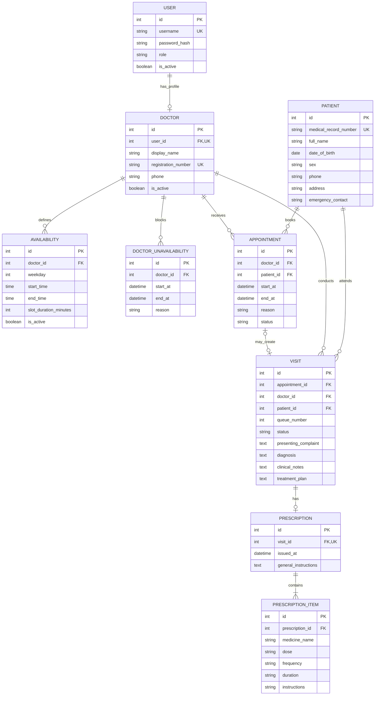

# Medical Clinic Management Web Application

A simple web application for managing an OPD clinic operated by two doctors. It brings patient registration, doctor schedules, appointments, consultations and prescriptions into one system.

The first version is designed for local use.

## Main features

- Secure login for administrators and doctors.
- Patient registration, search and visit history.
- Working schedules and unavailability periods for both doctors.
- Appointment booking, rescheduling and cancellation.
- Prevention of duplicate bookings for the same doctor and time.
- Patient check-in, walk-in registration and a daily OPD queue.
- Consultation notes, diagnoses and treatment plans.
- Prescriptions with medicine instructions and printable output.
- A dashboard showing today's appointments and waiting patients.

## Technology

- Python and FastAPI
- SQLAlchemy for database access
- SQLite for the initial local version
- Jinja templates, HTML, Bootstrap and minimal JavaScript

PostgreSQL and cloud hosting can be introduced later if the clinic needs to support more users or remote access.

## Entity relationship diagram

### How to read the diagram

- `PK` means primary key: the unique identifier of a record.
- `FK` means foreign key: a reference to a record in another entity.
- `UK` means unique key: a value that cannot be repeated.
- `||` means exactly one.
- `o|` means zero or one.
- `o{` means zero or many.
- `|{` means one or many.

### Entities

- **User:** Stores login and access information. A user may have one doctor profile.
- **Doctor:** Stores the professional details of each doctor and connects them to their login account.
- **Patient:** Stores patient identity and contact information. One patient can have many appointments and visits.
- **Availability:** Stores the normal weekdays and hours during which a doctor accepts appointments.
- **Doctor unavailability:** Blocks a specific date or time when a doctor is not available, such as leave.
- **Appointment:** Stores a scheduled booking between a patient and a doctor. Its status shows whether it is scheduled, completed, cancelled or a no-show.
- **Visit:** Represents the patient's actual OPD consultation. It stores the queue number, complaint, diagnosis, clinical notes and treatment plan.
- **Prescription:** Stores the general prescription information for a visit.
- **Prescription item:** Stores each medicine in a prescription, including its dose, frequency, duration and instructions.

### Main relationships

- One doctor can define many availability and unavailability periods.
- One doctor can receive many appointments, but each appointment belongs to one doctor.
- One patient can make many appointments, but each appointment belongs to one patient.
- A scheduled appointment may create one visit when the patient checks in.
- A walk-in patient creates a visit without an appointment. This is why the appointment reference in `VISIT` is optional.
- Every visit belongs to one patient and is conducted by one doctor.
- A visit may have one prescription.
- A prescription must contain one or more prescription items.

### Typical data flow

1. A doctor account and working availability are created.
2. A patient is registered.
3. An appointment is booked using an available doctor and time.
4. When the patient arrives, the appointment creates a visit and a queue number is assigned.
5. The doctor records the consultation and may create a prescription with one or more medicines.

For a walk-in patient, the process starts with a patient record and a visit; no appointment is required.
