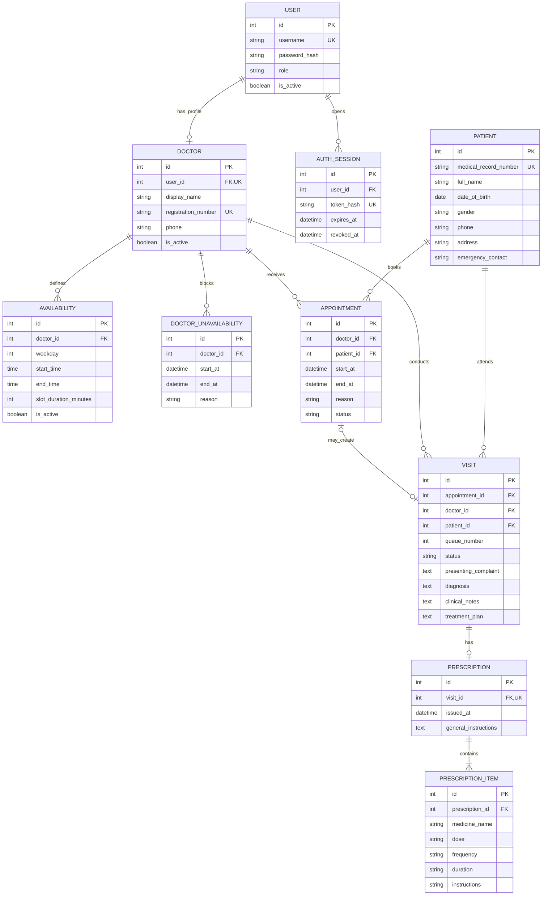

# Medical Clinic Management Web Application

A simple web application for managing an OPD clinic operated by two doctors. It brings patient registration, doctor schedules, appointments, consultations and prescriptions into one system.

The first version is designed for local use.

## Main features

- Secure login for administrators and doctors.
- Patient registration, search and visit history.
- Working schedules and unavailability periods for both doctors.
- Appointment booking, rescheduling and cancellation.
- Prevention of duplicate bookings for the same doctor and time.
- Patient check-in, walk-in registration and a daily OPD queue.
- Consultation notes, diagnoses and treatment plans.
- Prescriptions with medicine instructions and printable output.
- A dashboard showing today's appointments and waiting patients.

## Technology

- Python and FastAPI
- SQLAlchemy for database access
- PostgreSQL with the Psycopg driver

A cloud deployment can be introduced later if the clinic needs to support remote access.

## Run the application locally

### 1. Install Python and PostgreSQL

Install Python 3.14 and confirm that it is available:

```bash
python3 --version
```

Install PostgreSQL and pgAdmin, then start the local PostgreSQL server.

### 2. Create the PostgreSQL databases

The application can create tables only after its PostgreSQL database exists. In pgAdmin, connect to the default `postgres` database and open **Query Tool**. Run each statement separately, replacing the example password with your own password:

```sql
CREATE ROLE clinic_app WITH LOGIN PASSWORD 'change-this-password';
```

```sql
CREATE DATABASE medical_clinic OWNER clinic_app;
```

### 3. Create a virtual environment

Open Terminal in the project folder, then create and activate a virtual environment:

```bash
python3 -m venv .venv
source .venv/bin/activate
```

When the environment is active, `(.venv)` appears at the beginning of the Terminal prompt.

### 4. Install the dependencies

```bash
python -m pip install -r requirements.txt
```

### 5. Create the environment file

Copy the example configuration:

```bash
cp .env.example .env
```

Open `.env`, replace `change-this-password` in the PostgreSQL URL with the password used when creating `clinic_app`, and choose strong initial passwords for the administrator and both doctors. The `.env` file is ignored by Git because it contains database credentials and other secrets.

### 6. Create the tables and start the application

```bash
python main.py
```

At startup, SQLAlchemy connects to `medical_clinic` and creates any missing tables, constraints and relationships from the application models. It also adds the initial administrator and two doctor accounts. The application intentionally accepts only a `postgresql+psycopg://` database URL.

Open these addresses in a web browser:

- Application: http://127.0.0.1:8000
- Interactive API documentation: http://127.0.0.1:8000/docs
- Health check: http://127.0.0.1:8000/api/health

Press `Control+C` in Terminal to stop the application.

### Run with PyCharm

Select `.venv/bin/python` as the project interpreter. Create a Python Run Configuration with `main.py` as the script and the project folder as the working directory, then click **Run**. Starting `main.py` also initializes the database automatically.

### Run the tests

Confirm that PostgreSQL is running, then run:

```bash
pytest
```

Tests use `CLINIC_DATABASE_URL` and create a uniquely named temporary PostgreSQL schema. Only that temporary schema is removed after each test; the application's normal tables and clinic data are not changed.

## Authentication and doctor accounts

The local environment uses these initial usernames:

- Administrator: `admin`
- Doctor One: `doctor1`
- Doctor Two: `doctor2`

Before creating a new database, set `CLINIC_ADMIN_PASSWORD`, `CLINIC_DOCTOR_ONE_PASSWORD` and `CLINIC_DOCTOR_TWO_PASSWORD` in `.env`. There are no initial password defaults in the Python code. These values create missing accounts only and never overwrite passwords for existing accounts.

Log in with `POST /api/auth/login`, then copy the returned access token. In the interactive API documentation, click **Authorize** and enter the token to call protected endpoints. `POST /api/auth/logout` immediately revokes the current token.

Logged-in users can change their password with `PUT /api/auth/password`. They must provide their current password and a new password of at least 12 characters. Administrators can reset another account with `PUT /api/admin/users/{user_id}/password`. A password change or reset revokes all active sessions for that account and requires a new login.

### Permissions

- Administrators can view both doctor profiles, update either profile and activate or deactivate a doctor.
- Doctors can view doctor profiles and update their own display name or phone number.
- Doctors cannot update another doctor's profile or change registration and active-status fields.

### Authentication and doctor APIs

- `POST /api/auth/login` — log in and create a session.
- `POST /api/auth/logout` — log out and revoke the current session.
- `GET /api/auth/me` — return the logged-in account and doctor profile.
- `PUT /api/auth/password` — change the logged-in user's password.
- `PUT /api/admin/users/{user_id}/password` — let an administrator reset a user's password.
- `GET /api/doctors` — list doctor profiles.
- `GET /api/doctors/me` — return the logged-in doctor's profile.
- `PATCH /api/doctors/me` — let a doctor update their own profile.
- `GET /api/doctors/{doctor_id}` — return one doctor profile.
- `PATCH /api/doctors/{doctor_id}` — let an administrator update a doctor profile.

## Patient management

After logging in, administrators and doctors can:

- Register a patient and receive an automatically generated medical record number.
- Search patients by medical record number, name or phone number.
- View and edit patient details.

Patient management is currently available through these protected REST endpoints:

- `POST /api/patients` — register a patient.
- `GET /api/patients` — list patients or search with the `query` parameter.
- `GET /api/patients/{patient_id}` — return one patient's details.
- `PATCH /api/patients/{patient_id}` — update a patient's details.

## Entity relationship diagram



### How to read the diagram

- `PK` means primary key: the unique identifier of a record.
- `FK` means foreign key: a reference to a record in another entity.
- `UK` means unique key: a value that cannot be repeated.
- `||` means exactly one.
- `o|` means zero or one.
- `o{` means zero or many.
- `|{` means one or many.

### Entities

- **User:** Stores login and access information. A user may have one doctor profile.
- **Authentication session:** Stores a hashed login token, its expiry time and when it was revoked. A user can have multiple sessions.
- **Doctor:** Stores the professional details of each doctor and connects them to their login account.
- **Patient:** Stores patient identity and contact information. One patient can have many appointments and visits.
- **Availability:** Stores the normal weekdays and hours during which a doctor accepts appointments.
- **Doctor unavailability:** Blocks a specific date or time when a doctor is not available, such as leave.
- **Appointment:** Stores a scheduled booking between a patient and a doctor. Its status shows whether it is scheduled, completed, cancelled or a no-show.
- **Visit:** Represents the patient's actual OPD consultation. It stores the queue number, complaint, diagnosis, clinical notes and treatment plan.
- **Prescription:** Stores the general prescription information for a visit.
- **Prescription item:** Stores each medicine in a prescription, including its dose, frequency, duration and instructions.

### Main relationships

- One doctor can define many availability and unavailability periods.
- One user can open many authentication sessions. Logging out revokes the current session.
- One doctor can receive many appointments, but each appointment belongs to one doctor.
- One patient can make many appointments, but each appointment belongs to one patient.
- A scheduled appointment may create one visit when the patient checks in.
- A walk-in patient creates a visit without an appointment. This is why the appointment reference in `VISIT` is optional.
- Every visit belongs to one patient and is conducted by one doctor.
- A visit may have one prescription.
- A prescription must contain one or more prescription items.

### Typical data flow

1. A doctor account and working availability are created.
2. A patient is registered.
3. An appointment is booked using an available doctor and time.
4. When the patient arrives, the appointment creates a visit and a queue number is assigned.
5. The doctor records the consultation and may create a prescription with one or more medicines.

For a walk-in patient, the process starts with a patient record and a visit; no appointment is required.
